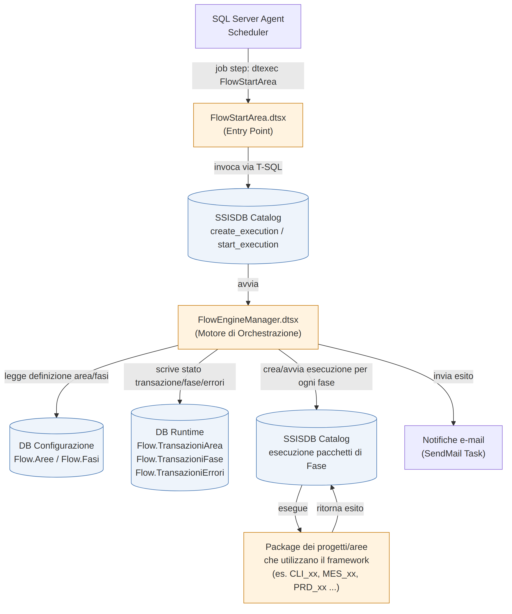
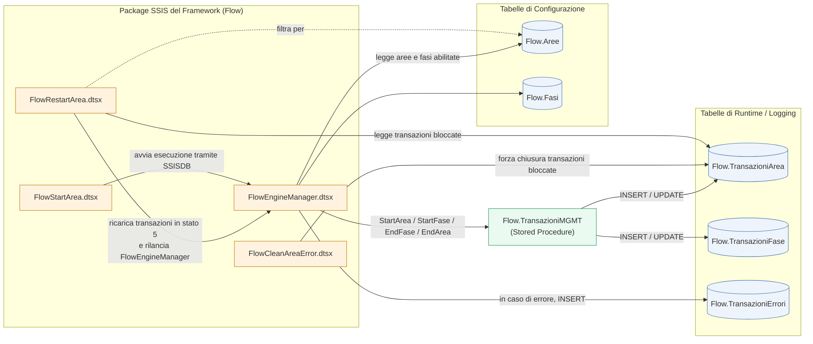
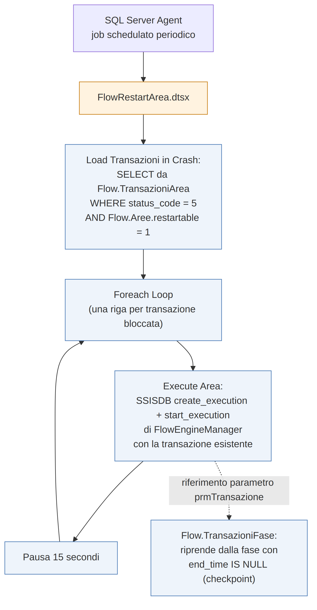
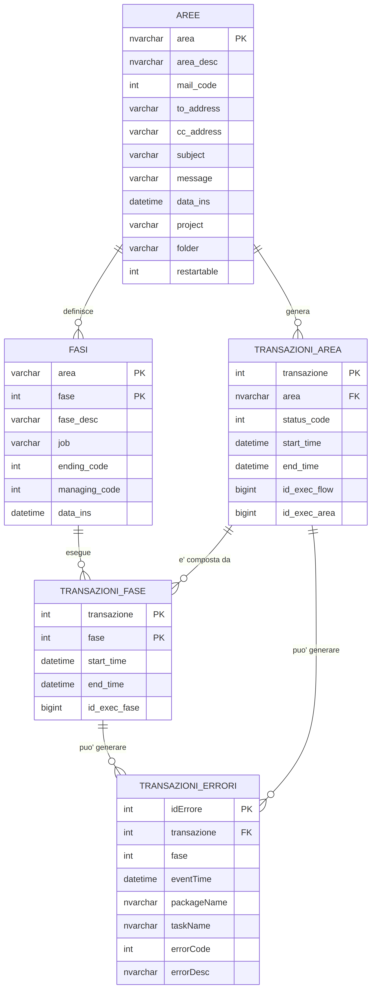
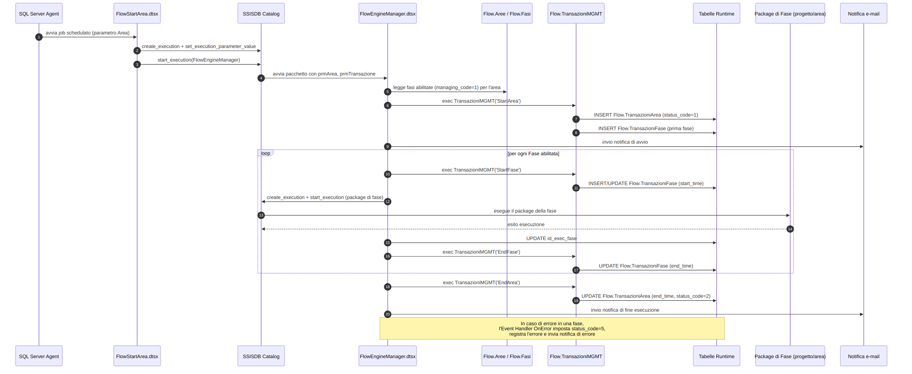
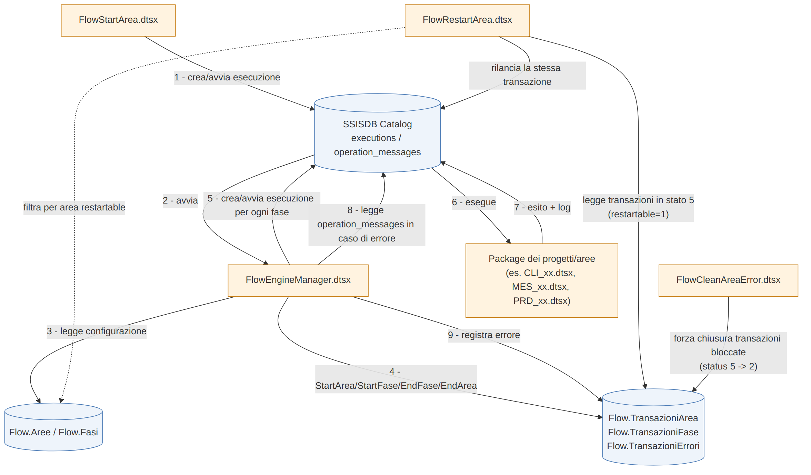
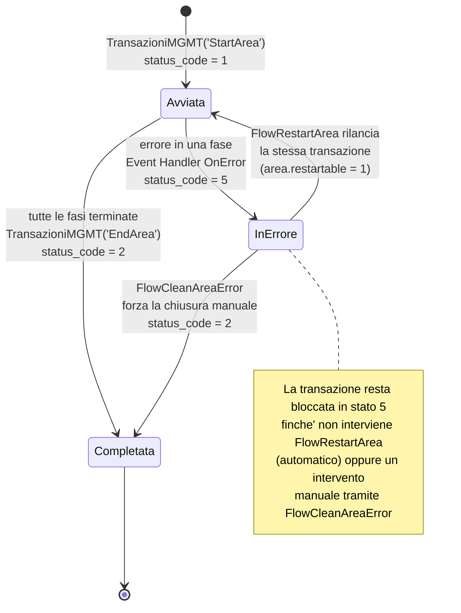

# SSIS Flow Framework — Documentazione Tecnica

**Progetto:** DataHub / Flow Framework
**Ambito:** Orchestrazione di elaborazioni SSIS (SQL Server Integration Services)
**Versione documento:** 1.0

---

## Indice

1. [Introduzione e scopo del framework](#1-introduzione-e-scopo-del-framework)
2. [Architettura generale](#2-architettura-generale)
3. [Componenti principali](#3-componenti-principali)
4. [Meccanismi comuni](#4-meccanismi-comuni)
5. [Schema ER delle tabelle](#5-schema-er-delle-tabelle)
6. [Tabelle e stored procedure di configurazione](#6-tabelle-e-stored-procedure-di-configurazione)
7. [Tabelle di logging/errori](#7-tabelle-di-loggingerrori)
8. [Sequenza esecutiva di una elaborazione](#8-sequenza-esecutiva-di-una-elaborazione)
9. [Interazioni principali fra i componenti](#9-interazioni-principali-fra-i-componenti)
10. [Evoluzione dello stato Runtime di una transazione](#10-evoluzione-dello-stato-runtime-di-una-transazione)
11. [Descrizione dei componenti di ogni package](#11-descrizione-dei-componenti-di-ogni-package)
12. [Utilizzo e integrazione con SSISDB](#12-utilizzo-e-integrazione-con-ssisdb)
13. [Convenzioni per i progetti che utilizzano il framework](#13-convenzioni-per-i-progetti-che-utilizzano-il-framework)

---

## 1. Introduzione e scopo del framework

Il **Flow Framework** è un motore di orchestrazione costruito sopra SQL Server Integration Services (SSIS) e il catalogo **SSISDB**, con l'obiettivo di fornire un meccanismo comune, riusabile e tracciabile per l'esecuzione delle elaborazioni ETL (Extract, Transform, Load) del data warehouse **DataHub**.

Ogni processo di business che deve essere schedulato ed eseguito (import di clienti, sincronizzazioni con CRM, invii verso sistemi esterni come EasyVista, elaborazioni MES, ecc.) viene modellato come una **Area**, suddivisa in una sequenza ordinata di **Fasi**. Ogni fase corrisponde tipicamente a un package SSIS specifico del progetto che implementa quella parte di logica.

Il framework risolve in modo centralizzato e uniforme problemi che, altrimenti, ogni progetto ETL dovrebbe reimplementare singolarmente:

- **Orchestrazione**: quale fase eseguire, in quale ordine, e come propagare i parametri necessari.
- **Tracciabilità**: chi ha eseguito cosa, quando, con quale esito, con riferimento diretto alle esecuzioni registrate in SSISDB.
- **Gestione degli errori**: intercettazione centralizzata degli errori, registrazione strutturata e notifica via e-mail.
- **Restart/Checkpoint**: possibilità di riprendere un'elaborazione interrotta dalla fase in cui si è fermata, senza dover rieseguire l'intero processo da capo.
- **Parametrizzazione uniforme**: tutti i package aderenti al framework ricevono gli stessi parametri di contesto (area, transazione, fase, cartella/progetto SSISDB).

Il vantaggio principale è che un nuovo progetto ETL non deve costruire da zero la logica di scheduling, logging ed error handling: è sufficiente registrare l'area e le sue fasi nelle tabelle di configurazione e implementare i package delle singole fasi seguendo le convenzioni descritte nella [sezione 13](#13-convenzioni-per-i-progetti-che-utilizzano-il-framework).

---

## 2. Architettura generale

Il flusso di esecuzione ha origine da **SQL Server Agent**, che schedula un job per ciascuna area da elaborare. Il job invoca il package **FlowStartArea.dtsx**, che rappresenta il punto di ingresso (entry point) del framework: il suo unico compito è avviare, tramite una chiamata al catalogo SSISDB, il package motore **FlowEngineManager.dtsx**, passandogli l'area da elaborare.

**FlowEngineManager.dtsx** è il vero motore di orchestrazione: legge la configurazione dell'area (schema di configurazione), determina quali fasi eseguire, registra lo stato di avanzamento (schema di runtime/logging), ed esegue ciascuna fase invocando — sempre tramite SSISDB — il package specifico del progetto/area che implementa quella fase.



**Descrizione del flusso:**

1. **SQL Server Agent Scheduler** avvia, secondo una schedulazione periodica, il job che esegue `FlowStartArea.dtsx` con il parametro dell'area da processare.
2. `FlowStartArea.dtsx` invoca le stored procedure di sistema del catalogo SSISDB (`create_execution`, `set_execution_parameter_value`, `start_execution`) per avviare `FlowEngineManager.dtsx` in modalità sincrona, passando i parametri di progetto (area, transazione, cartella e nome progetto SSISDB).
3. `FlowEngineManager.dtsx`, una volta avviato:
   - legge lo **schema di configurazione** (`Flow.Aree`, `Flow.Fasi`) per determinare quali fasi eseguire e in quale ordine;
   - aggiorna lo **schema di runtime** (`Flow.TransazioniArea`, `Flow.TransazioniFase`, `Flow.TransazioniErrori`) per tracciare avvio, avanzamento, chiusura ed eventuali errori;
   - effettua nuove chiamate al **catalogo SSISDB** per ogni fase, avviando il package specifico del progetto/area associato a quella fase;
   - invia notifiche e-mail di avvio, chiusura ed eventuale errore.
4. I **package dei progetti/aree** (es. `CLI_01_customers_clientiAS.dtsx`, `MES_10_importAS.dtsx`, `PRD_01_BC_Items.dtsx`, ecc.) contengono la logica ETL specifica e vengono eseguiti come esecuzioni figlie tracciate nel catalogo SSISDB.

Questa architettura disaccoppia completamente la logica di **orchestrazione** (comune a tutte le aree) dalla logica di **elaborazione dati** (specifica di ogni progetto), permettendo di aggiungere nuove aree senza modificare il motore.

---

## 3. Componenti principali

Il framework è composto da quattro package SSIS, un insieme di tabelle di configurazione/runtime e una stored procedure centrale che ne governa gli accessi.



| Componente | Tipo | Ruolo |
|---|---|---|
| `FlowStartArea.dtsx` | Package SSIS | Entry point: avvia una nuova esecuzione di `FlowEngineManager.dtsx` per l'area richiesta. |
| `FlowEngineManager.dtsx` | Package SSIS | Motore di orchestrazione: gestisce l'intero ciclo di vita di una transazione (area) e delle sue fasi. |
| `FlowRestartArea.dtsx` | Package SSIS | Utility di ripristino: individua le transazioni rimaste bloccate in stato di errore e, per le aree marcate come riavviabili, le rilancia automaticamente. |
| `FlowCleanAreaError.dtsx` | Package SSIS | Utility di chiusura manuale: forza la chiusura di una transazione bloccata in errore, dopo un intervento correttivo manuale. |
| `Flow.Aree` | Tabella di configurazione | Anagrafica delle aree gestite dal framework (progetto, cartella SSISDB, destinatari notifiche, riavviabilità). |
| `Flow.Fasi` | Tabella di configurazione | Anagrafica ordinata delle fasi che compongono ciascuna area, con il riferimento al package da eseguire. |
| `Flow.TransazioniArea` | Tabella di runtime | Una riga per ogni esecuzione (transazione) di un'area: stato, orari, riferimenti alle esecuzioni SSISDB. |
| `Flow.TransazioniFase` | Tabella di runtime | Una riga per ogni fase eseguita all'interno di una transazione: orari e riferimento all'esecuzione SSISDB della fase. |
| `Flow.TransazioniErrori` | Tabella di logging | Dettaglio degli errori intercettati durante l'esecuzione di una transazione/fase, con i messaggi originali del catalogo SSISDB. |
| `Flow.TransazioniMGMT` | Stored procedure | Unico punto di accesso in scrittura alle tabelle di runtime: gestisce l'apertura/chiusura di transazioni e fasi. |

---

## 4. Meccanismi comuni

Il framework offre alle aree che lo adottano una serie di meccanismi trasversali, uniformi per tutti i progetti.

### 4.1 Logging

Ogni transazione (esecuzione di un'area) e ogni sua fase vengono tracciate rispettivamente in `Flow.TransazioniArea` e `Flow.TransazioniFase`, con orari di inizio/fine e riferimento diretto all'`execution_id` dell'esecuzione SSISDB corrispondente (`id_exec_flow`, `id_exec_area`, `id_exec_fase`). Questo consente di correlare in ogni momento una riga di runtime con l'esecuzione fisica registrata nel catalogo SSISDB e con i relativi log (`SSISDB.catalog.operation_messages`, `SSISDB.catalog.executions`).

### 4.2 Gestione degli errori

`FlowEngineManager.dtsx` intercetta centralmente qualunque errore sollevato durante l'esecuzione di una fase attraverso un **Event Handler `OnError`** a livello di package. Alla comparsa di un errore:

1. la transazione viene marcata come bloccata (`Flow.TransazioniArea.status_code = 5`);
2. i messaggi di errore vengono estratti da `SSISDB.catalog.operation_messages` (filtrando i messaggi di tipo errore, `message_type = 120`) e registrati in `Flow.TransazioniErrori`, con riferimento alla fase e alla transazione coinvolte;
3. viene inviata una notifica e-mail di errore ai destinatari configurati per l'area (`Flow.Aree.to_address` / `cc_address`).

Questo meccanismo evita che ogni package di fase debba implementare una propria logica di error handling: è sufficiente che fallisca in modo standard (task con `FailPackageOnFailure = True`) perché l'errore risalga fino a `FlowEngineManager.dtsx` e venga gestito centralmente.

### 4.3 Parametrizzazione

Tutte le chiamate tra package avvengono tramite i **parametri di progetto SSISDB** (Project Parameters), valorizzati con `SSISDB.catalog.set_execution_parameter_value` al momento della `create_execution`. I parametri principali condivisi dal framework sono:

- `prmArea` — codice area (`Flow.Aree.area`);
- `prmTransazione` — identificativo della transazione corrente (`Flow.TransazioniArea.transazione`);
- `prmFase` — numero della fase corrente (`Flow.Fasi.fase`);
- `prmProjectFolder` / `prmProject` — cartella e nome del progetto SSISDB in cui risiede il package dell'area, usati per costruire dinamicamente il riferimento al package da eseguire (`create_execution`);
- `prmExecutionIDFlow` — `execution_id` dell'esecuzione "padre" di `FlowEngineManager.dtsx`, propagato per correlare le esecuzioni figlie.

Questa parametrizzazione uniforme consente al motore di invocare qualsiasi package di fase, di qualunque progetto, senza conoscerne i dettagli interni: gli basta conoscere cartella, progetto e nome package (composti a partire da `Flow.Fasi.job`).

### 4.4 Connection Manager condivisi

I package di framework operano nel **Project Deployment Model** di SSIS: `FlowEngineManager.dtsx` fa riferimento a un **connection manager a livello di progetto** (identificato dal proprio GUID), condiviso con gli altri package del progetto. In questo modo la stringa di connessione al database `DataHub` è definita in un unico punto e può essere modificata centralmente (ad esempio in fase di promozione tra ambienti) senza dover intervenire su ogni singolo package. I package "satellite" invocati direttamente da SQL Server Agent (`FlowStartArea`, `FlowRestartArea`, `FlowCleanAreaError`) dispongono invece di un proprio connection manager locale verso lo stesso database, poiché vengono eseguiti come utility indipendenti.

### 4.5 Restart / Checkpoint

Il framework implementa un meccanismo di ripristino a **due livelli**:

- **Checkpoint a livello di fase**: `Flow.TransazioniFase` mantiene traccia di quali fasi di una transazione sono state completate (`end_time` valorizzato) e quale fase è rimasta aperta (`end_time IS NULL`). Quando una transazione viene ripresa, il motore individua automaticamente la fase da cui ripartire tramite la query di determinazione fasi (si veda [Sezione 6](#6-tabelle-e-stored-procedure-di-configurazione)), evitando di rieseguire le fasi già concluse con successo.
- **Checkpoint a livello di package**: alcuni package di fase possono inoltre implementare il meccanismo nativo di *checkpoint file* di SSIS, per riprendere l'elaborazione interna al punto di interruzione anche all'interno della singola fase.

Il riavvio automatico è delegato al package `FlowRestartArea.dtsx`, tipicamente schedulato anch'esso da SQL Server Agent con frequenza periodica:



`FlowRestartArea.dtsx` individua tutte le transazioni in stato di errore (`status_code = 5`) appartenenti ad aree marcate come riavviabili (`Flow.Aree.restartable = 1`) e, per ciascuna di esse, rilancia `FlowEngineManager.dtsx` passando la transazione esistente: il motore riconoscerà che la transazione è già presente e riprenderà dalla fase interrotta, invece di aprirne una nuova.

---

## 5. Schema ER delle tabelle



Lo schema è composto da due tabelle di **configurazione** (`Flow.Aree`, `Flow.Fasi`) e tre tabelle di **runtime/logging** (`Flow.TransazioniArea`, `Flow.TransazioniFase`, `Flow.TransazioniErrori`), tutte collocate nello schema `Flow` del database `DataHub`.

- Un'**Area** (`Flow.Aree`) definisce N **Fasi** (`Flow.Fasi`), in relazione 1:N tramite la chiave `area`.
- Un'**Area** genera N **Transazioni** (`Flow.TransazioniArea`), una per ogni esecuzione.
- Ogni **Transazione** è composta da N righe in `Flow.TransazioniFase`, una per ogni fase effettivamente eseguita.
- Sia una transazione (a livello di area, `fase = 0`) sia una singola fase possono generare N righe di errore in `Flow.TransazioniErrori`.

---

## 6. Tabelle e stored procedure di configurazione

### 6.1 `Flow.Aree`

Anagrafica delle aree gestite dal framework. Ogni riga rappresenta un processo di business orchestrabile.

| Colonna | Tipo | Significato |
|---|---|---|
| `area` (PK) | `nvarchar(50)` | Codice univoco dell'area (es. `CLIENTI`, `MES_COMMESSE`, `PRD_PRODOTTI`). |
| `area_desc` | `nvarchar(100)` | Descrizione leggibile dell'area. |
| `mail_code` | `int` | Codice che determina il profilo di notifica da applicare (es. livello di dettaglio/destinatari). |
| `to_address` | `varchar(250)` | Destinatari principali delle notifiche e-mail (avvio, fine, errore). |
| `cc_address` | `varchar(250)` | Destinatari in copia conoscenza delle notifiche. |
| `subject` | `varchar(250)` | Oggetto e-mail predefinito (dato di configurazione, riutilizzabile dai template di notifica). |
| `message` | `varchar(250)` | Testo e-mail predefinito. |
| `data_ins` | `datetime` | Data di inserimento della configurazione (default `getdate()`). |
| `project` | `varchar(20)` | Nome/prefisso del progetto SSIS proprietario dell'area (es. `CLI`, `MES`, `PRD`, `TEL`, `PDB`). |
| `folder` | `varchar(50)` | Cartella SSISDB in cui è pubblicato il progetto (default `DataHub`). |
| `restartable` | `int` | Flag (0/1) che indica se `FlowRestartArea.dtsx` può rilanciare automaticamente le transazioni di quest'area rimaste in errore. |

### 6.2 `Flow.Fasi`

Anagrafica ordinata delle fasi che compongono ciascuna area.

| Colonna | Tipo | Significato |
|---|---|---|
| `area` (PK, FK) | `varchar(20)` | Area di appartenenza (riferimento logico a `Flow.Aree.area`). |
| `fase` (PK) | `int` | Numero progressivo della fase all'interno dell'area; determina l'ordine di esecuzione. |
| `fase_desc` | `varchar(50)` | Descrizione della fase. |
| `job` | `varchar(50)` | Nome del package SSIS (`.dtsx`) che implementa la fase, pubblicato nel progetto/cartella SSISDB dell'area. |
| `ending_code` | `int` | Se impostato a `1`, indica che questa è l'**ultima fase** dell'area: il motore la usa come limite superiore nella determinazione delle fasi da eseguire. |
| `managing_code` | `int` | Se impostato a `1`, la fase è **gestita automaticamente** da `FlowEngineManager.dtsx`. Le fasi con `managing_code = 0` sono presenti in anagrafica a scopo documentale/di tracciamento ma non vengono orchestrate dal motore (es. trigger esterni o processi non ancora integrati nel framework). |
| `data_ins` | `datetime` | Data di inserimento della configurazione. |

> **Nota sulla numerazione osservata:** nei dati di esempio le fasi sono raggruppate per intervalli numerici con significato logico (es. 1–9 import da sistemi sorgente, 11–19 import da CRM, 21–29 preprocessing/staging, 51–69 sincronizzazioni verso sistemi terzi, 9x fase conclusiva). Questa è una convenzione adottata dai progetti esistenti, utile come riferimento per numerare le fasi di nuove aree (si veda [Sezione 13](#13-convenzioni-per-i-progetti-che-utilizzano-il-framework)), ma non è un vincolo imposto dallo schema.

### 6.3 `Flow.TransazioniMGMT` (Stored Procedure)

Punto di accesso unico e centralizzato in scrittura alle tabelle di runtime `Flow.TransazioniArea` e `Flow.TransazioniFase`. Viene invocata da `FlowEngineManager.dtsx` in quattro momenti del ciclo di vita di una transazione, tramite il parametro `@P_STEP_FLOW`:

| Parametro | Tipo | Descrizione |
|---|---|---|
| `@P_AREA` | `nvarchar(50)` | Area su cui operare. |
| `@P_FASE` | `int` | Fase su cui operare (`0` per le operazioni a livello di area). |
| `@P_STEP_FLOW` | `nvarchar(10)` | Operazione richiesta: `StartArea`, `StartFase`, `EndFase`, `EndArea`. |
| `@P_TRANSAZIONE` | `int OUTPUT` | Identificativo della transazione: in input se già esistente (restart), in output se appena creata. |

Comportamento per valore di `@P_STEP_FLOW`:

- **`StartArea`**: inserisce una nuova riga in `Flow.TransazioniArea` con `status_code = 1` e restituisce il nuovo `transazione` (identity). Prosegue quindi anche con la logica di `StartFase` per la prima fase.
- **`StartArea` / `StartFase`**: inserisce (se non già presente) la riga corrispondente in `Flow.TransazioniFase`, con `start_time = getdate()`.
- **`EndFase` / `EndArea`**: aggiorna la riga di `Flow.TransazioniFase` corrispondente, valorizzando `end_time`.
- **`EndArea`**: aggiorna inoltre `Flow.TransazioniArea`, valorizzando `end_time` e impostando `status_code = 2` (completata).

---

## 7. Tabelle di logging/errori

### 7.1 `Flow.TransazioniArea`

Una riga per ogni esecuzione (transazione) di un'area.

| Colonna | Tipo | Significato |
|---|---|---|
| `transazione` (PK) | `int identity` | Identificativo univoco della transazione/esecuzione dell'area. |
| `area` | `nvarchar(50)` | Area a cui si riferisce la transazione. |
| `status_code` | `int` | Stato corrente della transazione (si veda [Sezione 10](#10-evoluzione-dello-stato-runtime-di-una-transazione)). |
| `start_time` | `datetime` | Istante di avvio della transazione. |
| `end_time` | `datetime` | Istante di chiusura della transazione (valorizzato solo a completamento). |
| `id_exec_flow` | `bigint` | `execution_id` SSISDB dell'esecuzione di `FlowEngineManager.dtsx` che gestisce la transazione. |
| `id_exec_area` | `bigint` | `execution_id` SSISDB dell'esecuzione più recente del progetto associato all'area. |

### 7.2 `Flow.TransazioniFase`

Una riga per ogni fase eseguita all'interno di una transazione.

| Colonna | Tipo | Significato |
|---|---|---|
| `transazione` (PK, FK) | `int` | Transazione di appartenenza. |
| `fase` (PK) | `int` | Numero della fase eseguita (riferimento logico a `Flow.Fasi.fase`). |
| `start_time` | `datetime` | Istante di avvio della fase. |
| `end_time` | `datetime` | Istante di chiusura della fase; se `NULL`, la fase è considerata "aperta" e rappresenta il **checkpoint** da cui ripartire in caso di restart. |
| `id_exec_fase` | `bigint` | `execution_id` SSISDB dell'esecuzione del package che implementa la fase. |

### 7.3 `Flow.TransazioniErrori`

Dettaglio degli errori intercettati durante l'esecuzione.

| Colonna | Tipo | Significato |
|---|---|---|
| `idErrore` (PK) | `int identity` | Identificativo univoco della riga di errore. |
| `transazione` | `int` | Transazione in cui si è verificato l'errore. |
| `fase` | `int` | Fase in cui si è verificato l'errore (`0` se l'errore è a livello di area). |
| `eventTime` | `datetime` | Istante di registrazione dell'errore. |
| `packageName` | `nvarchar(100)` | Nome del package/componente da cui è stato estratto il messaggio (tipicamente `FlowEngineManager`). |
| `taskName` | `nvarchar(100)` | Nome del task/componente in cui si è verificato l'errore, ricavato dal messaggio SSISDB. |
| `errorCode` | `int` | Identificativo del messaggio di errore nel catalogo SSISDB (`operation_message_id`). |
| `errorDesc` | `nvarchar(max)` | Testo completo del messaggio di errore, così come registrato in `SSISDB.catalog.operation_messages`. |

---

## 8. Sequenza esecutiva di una elaborazione

Il diagramma seguente descrive la sequenza tipica di esecuzione di un'area con più fasi, dall'avvio pianificato fino alla notifica di chiusura.



**Passi principali:**

1. **SQL Server Agent** avvia `FlowStartArea.dtsx` secondo la schedulazione configurata per l'area.
2. `FlowStartArea.dtsx` crea e avvia, tramite le stored procedure di sistema di SSISDB, un'esecuzione di `FlowEngineManager.dtsx`, passando l'area da elaborare.
3. `FlowEngineManager.dtsx` legge da `Flow.Aree`/`Flow.Fasi` l'elenco delle fasi abilitate (`managing_code = 1`) ancora da eseguire per l'area.
4. Viene invocata `Flow.TransazioniMGMT` con `StartArea`: viene aperta una nuova transazione (o riconosciuta una transazione esistente in caso di restart) e viene registrata l'apertura della prima fase.
5. Viene inviata la **notifica di avvio**.
6. Per ciascuna fase abilitata, in ordine:
   - `Flow.TransazioniMGMT('StartFase')` registra l'apertura della fase;
   - viene creata e avviata, tramite SSISDB, un'esecuzione del **package specifico della fase**;
   - al termine dell'esecuzione, l'`execution_id` viene salvato in `Flow.TransazioniFase.id_exec_fase` e, se l'esecuzione non è terminata con successo, viene sollevato un errore che attiva l'Event Handler `OnError`;
   - `Flow.TransazioniMGMT('EndFase')` registra la chiusura della fase.
7. Completate tutte le fasi, `Flow.TransazioniMGMT('EndArea')` chiude la transazione (`status_code = 2`).
8. Viene inviata la **notifica di fine esecuzione**.

In caso di errore in una qualunque fase, il flusso normale viene interrotto e gestito dall'Event Handler `OnError` descritto nella [Sezione 4.2](#42-gestione-degli-errori) e nella [Sezione 10](#10-evoluzione-dello-stato-runtime-di-una-transazione).

---

## 9. Interazioni principali fra i componenti

Il diagramma seguente riassume le interazioni tra i package del framework, le tabelle di configurazione/runtime, il catalogo SSISDB e i package dei progetti/aree.



Punti salienti:

- **`FlowStartArea.dtsx`** interagisce esclusivamente con **SSISDB**, per avviare `FlowEngineManager.dtsx`; non accede direttamente alle tabelle `Flow.*`.
- **`FlowEngineManager.dtsx`** è l'unico componente che orchestra realmente l'esecuzione: legge la configurazione, aggiorna il runtime tramite `Flow.TransazioniMGMT`, avvia i package di fase tramite SSISDB e, in caso di errore, consulta `SSISDB.catalog.operation_messages` per estrarre e registrare il dettaglio dell'errore.
- **`FlowRestartArea.dtsx`** legge lo stato delle transazioni bloccate (`Flow.TransazioniArea`) incrociandolo con la configurazione delle aree riavviabili (`Flow.Aree.restartable`), e rilancia `FlowEngineManager.dtsx` per ciascuna transazione da riprendere.
- **`FlowCleanAreaError.dtsx`** interviene esclusivamente sulle tabelle di runtime, senza interagire con SSISDB: è pensato come strumento di chiusura manuale a valle di una correzione applicata fuori dal framework.
- I **package dei progetti/aree** sono gli unici componenti che non conoscono il framework: ricevono parametri di contesto (`prmTransazione`, `prmFase`, ecc.) mai un riferimento diretto alle tabelle `Flow.*`, mantenendo così un disaccoppiamento pulito tra motore e logica applicativa.

---

## 10. Evoluzione dello stato Runtime di una transazione

Lo stato di ogni transazione è tracciato dal campo `Flow.TransazioniArea.status_code`. Il diagramma seguente ne descrive il ciclo di vita.



| Codice | Significato | Impostato da |
|---|---|---|
| `1` | **Avviata / In esecuzione** — la transazione è stata aperta ed è in corso di elaborazione. | `Flow.TransazioniMGMT('StartArea')`, invocata da `FlowEngineManager.dtsx`. |
| `2` | **Completata** — tutte le fasi previste sono state eseguite con successo, oppure la transazione è stata chiusa manualmente dopo un intervento correttivo. | `Flow.TransazioniMGMT('EndArea')` (chiusura normale) oppure `FlowCleanAreaError.dtsx` (chiusura forzata). |
| `5` | **In errore / Bloccata** — una fase ha generato un errore non gestito e l'esecuzione si è interrotta. | Event Handler `OnError` di `FlowEngineManager.dtsx` (task "Update TransazioniArea status 5"). |

**Transizioni possibili:**

- `1 → 2`: percorso "felice", tutte le fasi completate con successo.
- `1 → 5`: una fase fallisce; la transazione resta bloccata in attesa di intervento.
- `5 → 1`: `FlowRestartArea.dtsx` rilancia automaticamente `FlowEngineManager.dtsx` sulla stessa transazione (solo per aree con `restartable = 1`); il motore riprende dalla fase con `end_time IS NULL` in `Flow.TransazioniFase`.
- `5 → 2`: chiusura manuale tramite `FlowCleanAreaError.dtsx`, tipicamente dopo aver risolto il problema al di fuori del normale flusso automatico (es. correzione dati, area non riavviabile).

Non esistono transizioni dirette da `2` verso altri stati: una volta completata, una transazione è considerata definitivamente chiusa; una nuova esecuzione dell'area genera una nuova riga (nuova transazione) in `Flow.TransazioniArea`.

---

## 11. Descrizione dei componenti di ogni package

### `FlowStartArea.dtsx`

| Componente | Tipo | Descrizione |
|---|---|---|
| `SRVSQL02\DWH.datahub` | OLE DB Connection Manager | Connessione locale al database `DataHub`, usata per invocare le stored procedure di sistema di SSISDB. |
| `Execute Area` | Execute SQL Task | Crea ed avvia (in modalità sincrona) un'esecuzione di `FlowEngineManager.dtsx` nel catalogo SSISDB, passando `prmArea`, `prmTransazione`, `prmProjectFolder`, `prmProject`; verifica lo stato finale dell'esecuzione e solleva un errore SQL se diverso da "Succeeded" (`status = 7`). |

### `FlowEngineManager.dtsx`

| Componente | Tipo | Descrizione |
|---|---|---|
| `Setting of Flow Phases` | Execute SQL Task | Determina l'elenco delle fasi ancora da eseguire per l'area/transazione corrente e lo carica nel result set `ResultSetFasi`. |
| `Start Transazione` | Execute SQL Task | Apre (o riconosce, in caso di restart) la transazione tramite `Flow.TransazioniMGMT`; recupera i destinatari di notifica dall'anagrafica area (`MailTo`, `MailCC`, `MAIL_CODE`) e la prima fase da eseguire (`PRIMA_FASE`). |
| `Start Notification` | Send Mail Task | Invia la notifica di avvio elaborazione, con oggetto e corpo costruiti dinamicamente tramite espressioni (area e transazione). |
| `Loop Flow Phases` | Foreach Loop Container (ADO Enumerator su `ResultSetFasi`) | Itera su ciascuna fase da eseguire, valorizzando le variabili `Fase`, `Fase_Desc`, `Job`. |
| &nbsp;&nbsp;↳ `Start Fase` | Execute SQL Task | Registra l'apertura della fase tramite `Flow.TransazioniMGMT('StartFase')`. |
| &nbsp;&nbsp;↳ `Execute Fase` | Execute SQL Task | Crea ed avvia (in modalità sincrona) l'esecuzione SSISDB del package associato alla fase (`Flow.Fasi.job`), aggiorna `Flow.TransazioniFase.id_exec_fase` e verifica l'esito dell'esecuzione. |
| &nbsp;&nbsp;↳ `End Fase` | Execute SQL Task | Registra la chiusura della fase tramite `Flow.TransazioniMGMT('EndFase')`. |
| `End Transazione` | Execute SQL Task | Chiude la transazione tramite `Flow.TransazioniMGMT('EndArea')`. |
| `End Job Notification` | Send Mail Task | Invia la notifica di fine elaborazione. |
| `Event Handler: OnError` | Package Event Handler | Gestione centralizzata degli errori (si veda dettaglio sotto). |
| `Check Fase Transazione`, `Execute Package Task`, `RUNJOB`, `Script Execute Phase`, `Script Task` (root) | Script/Execute Package/Execute SQL Task | Componenti storici **disabilitati**, non attivi nel flusso di esecuzione corrente; mantenuti nel package a scopo di versionamento/riferimento. |

**Event Handler `OnError` — componenti attivi:**

| Componente | Tipo | Descrizione |
|---|---|---|
| `Update TransazioniArea status 5` | Execute SQL Task | Imposta `status_code = 5` sulla transazione corrente. |
| `Log TransazioniErrori` | Execute SQL Task | Estrae da `SSISDB.catalog.operation_messages` i messaggi di errore relativi alla fase (o alla transazione) e li inserisce in `Flow.TransazioniErrori`; compone inoltre il testo della notifica di errore. |
| `Notifica Errore` | Send Mail Task | Invia la notifica di errore, con oggetto costruito dinamicamente (transazione, area, fase, job). |
| `Log TransazioniErrori 1`, `Script Task`, `Notifica Errore 1 1` | Execute SQL / Script / Send Mail Task | Percorso alternativo di logging/notifica, presente nel package ma **disabilitato**. |

### `FlowRestartArea.dtsx`

| Componente | Tipo | Descrizione |
|---|---|---|
| `SRVSQL02\DWH.datahub` | OLE DB Connection Manager | Connessione locale al database `DataHub`. |
| `Load Transazioni in Crash` | Execute SQL Task | Seleziona le transazioni in `Flow.TransazioniArea` con `status_code = 5` la cui area è marcata `restartable = 1`, popolando il result set `vRows`. |
| `Foreach Loop Container` | Foreach Loop Container (ADO Enumerator su `vRows`) | Itera su ciascuna transazione da riavviare, valorizzando `vArea`, `vTransazione`, `vFolder`, `vProject`. |
| &nbsp;&nbsp;↳ `Execute Area` | Execute SQL Task | Crea ed avvia una nuova esecuzione SSISDB di `FlowEngineManager.dtsx`, passando la transazione esistente da riprendere. |
| &nbsp;&nbsp;↳ `Pausa 15 secondi` | Execute SQL Task (`WAITFOR DELAY`) | Introduce una pausa tra un riavvio e il successivo, per non sovraccaricare il motore/il server SSISDB. |

### `FlowCleanAreaError.dtsx`

| Componente | Tipo | Descrizione |
|---|---|---|
| `SRVSQL02\DWH.datahub` | OLE DB Connection Manager | Connessione locale al database `DataHub`. |
| `Clean Area` | Execute SQL Task | Forza la chiusura delle transazioni dell'area specificata rimaste in stato `5`, portandole a `status_code = 2`. Utilizzato dopo una correzione manuale del problema che aveva causato il blocco. |

---

## 12. Utilizzo e integrazione con SSISDB

Il framework si appoggia interamente sul **catalogo SSISDB** e sul modello di **Project Deployment** di SSIS per l'esecuzione dei package, senza utilizzare l'esecuzione tramite file system (`dtexec` su `.dtsx` standalone) per i package delle fasi.

Il pattern di invocazione, ripetuto in modo identico da `FlowStartArea.dtsx`, `FlowRestartArea.dtsx` e da `FlowEngineManager.dtsx` (per ogni fase), è il seguente:

```sql
-- 1. Creazione dell'oggetto di esecuzione
DECLARE @execution_id BIGINT
EXEC [SSISDB].[catalog].[create_execution]
    @folder_name      = @P_folder_name,
    @project_name     = @P_project_name,
    @package_name     = @P_package_name,
    @use32bitruntime  = 0,
    @reference_id     = NULL,
    @execution_id     = @execution_id OUTPUT

-- 2. Valorizzazione dei parametri di progetto
EXEC SSISDB.catalog.set_execution_parameter_value
    @execution_id, @object_type = 20, @parameter_name = N'prm...', @parameter_value = ...

-- 3. Impostazione dell'esecuzione sincrona
EXEC SSISDB.catalog.set_execution_parameter_value
    @execution_id, @object_type = 50, @parameter_name = N'SYNCHRONIZED', @parameter_value = 1

-- 4. Avvio dell'esecuzione
EXEC [SSISDB].[catalog].[start_execution] @execution_id

-- 5. Verifica dell'esito
IF 7 <> (SELECT [status] FROM [SSISDB].[catalog].[executions] WHERE execution_id = @execution_id)
    RAISERROR('The package failed. Check the SSIS catalog logs for more information', 16, 1)
```

Elementi chiave di questa integrazione:

- **Esecuzione sincrona (`SYNCHRONIZED = 1`)**: ogni chiamata attende il completamento del package figlio prima di proseguire, permettendo al motore di orchestrare in sequenza le fasi e di reagire immediatamente a un eventuale fallimento.
- **Verifica esplicita dello stato**: il codice `7` corrisponde allo stato "Succeeded" nel catalogo SSISDB; qualunque altro valore fa sollevare un errore T-SQL, che a sua volta fa fallire l'Execute SQL Task e attiva la propagazione dell'errore verso l'Event Handler `OnError`.
- **Tracciamento dell'`execution_id`**: ogni `execution_id` restituito da `create_execution` viene salvato nelle tabelle di runtime (`id_exec_flow`, `id_exec_area`, `id_exec_fase`), consentendo di risalire in ogni momento, a partire da una riga di `Flow.TransazioniArea`/`Flow.TransazioniFase`, alla relativa esecuzione e ai relativi log in `SSISDB.catalog.executions` e `SSISDB.catalog.operation_messages`.
- **Parametri di progetto come contratto di interfaccia**: i package delle fasi non necessitano di conoscere il framework; espongono semplicemente i parametri di progetto attesi (`prmTransazione`, `prmFase`, ecc.) che vengono valorizzati dal motore ad ogni esecuzione.
- **Estrazione dei log di errore**: in caso di fallimento, il framework interroga direttamente `SSISDB.catalog.operation_messages` (filtrando `message_type = 120`, messaggi di errore) collegandola tramite `operation_id = id_exec_fase` (o `id_exec_flow` per errori a livello di area), per riportare nella tabella applicativa `Flow.TransazioniErrori` il dettaglio nativo prodotto da SSIS, senza doverlo duplicare o reinterpretare.

---

## 13. Convenzioni per i progetti che lo utilizzano

Per integrare un nuovo progetto ETL nel Flow Framework, occorre seguire le convenzioni seguenti.

### 13.1 Registrazione dell'area

Inserire una riga in `Flow.Aree` con:

- un **codice area** univoco e descrittivo (es. `<PROGETTO>_<PROCESSO>`, in maiuscolo);
- il **progetto SSISDB** (`project`) e la **cartella** (`folder`) in cui verrà pubblicato il progetto contenente i package delle fasi;
- i **destinatari delle notifiche** (`to_address`, `cc_address`) per gli esiti di avvio/fine/errore;
- il flag **`restartable`**: impostarlo a `1` se il processo può essere rilanciato in autonomia da `FlowRestartArea.dtsx` in caso di errore transitorio (es. timeout di rete verso un sistema esterno), a `0` se richiede sempre una verifica manuale prima di essere ripreso.

### 13.2 Definizione delle fasi

Inserire in `Flow.Fasi` una riga per ciascuna fase del processo, rispettando l'ordine di esecuzione desiderato tramite il numero di `fase`:

- il campo **`job`** deve contenere il nome esatto del file `.dtsx` (con estensione) pubblicato nel progetto/cartella SSISDB indicati in `Flow.Aree`;
- impostare **`managing_code = 1`** su tutte le fasi che devono essere orchestrate automaticamente dal motore; riservare `managing_code = 0` a fasi documentali o gestite fuori dal framework (es. trigger esterni);
- impostare **`ending_code = 1`** esclusivamente sull'ultima fase del processo, così da delimitare correttamente l'intervallo di fasi da eseguire;
- è buona prassi, coerentemente con le aree esistenti, riservare **intervalli numerici** a gruppi logici di fasi (es. 1–9 estrazione dati da sorgente, 11–19 estrazione da un secondo sistema sorgente, 21–29 preparazione/staging, 5x–6x sincronizzazione verso sistemi terzi, 9x fase conclusiva), lasciando margine per inserimenti futuri senza dover rinumerare le fasi esistenti.

### 13.3 Convenzione di naming dei package

I package delle singole fasi seguono, nei progetti esistenti, il pattern:

```
<PREFISSO_AREA>_<NUMERO_FASE>_<descrizione_breve>.dtsx
```

ad esempio `CLI_01_customers_clientiAS.dtsx`, `MES_21_BC_Items_Refresh.dtsx`, `PRD_09_BC_ItemAttribute.dtsx`. Il prefisso corrisponde tipicamente al valore di `Flow.Aree.project` (o a una sua variante), rendendo immediato risalire all'area e alla fase di appartenenza dal solo nome del file.

### 13.4 Requisiti dei package di fase

Ogni package invocato come fase deve:

- essere pubblicato (deploy) nel progetto/cartella SSISDB indicati nella configurazione dell'area, in modo che possa essere risolto dinamicamente da `create_execution` tramite `@P_folder_name`/`@P_project_name`/`@P_package_name`;
- terminare in modo che un eventuale errore si traduca in un fallimento standard dell'esecuzione SSISDB (task con `FailPackageOnFailure = True`), in modo che venga rilevato dal controllo di stato (`status = 7`) eseguito da `FlowEngineManager.dtsx`;
- **non** implementare una propria logica di notifica o di scrittura sulle tabelle `Flow.*`: queste responsabilità restano centralizzate nel motore, per garantire uniformità di comportamento tra tutte le aree.

### 13.5 Schedulazione

Creare un job di SQL Server Agent che esegua `FlowStartArea.dtsx` con il parametro `prmArea` valorizzato con il codice della nuova area, secondo la frequenza richiesta dal processo di business. Non è necessario creare job dedicati per il restart o la pulizia: `FlowRestartArea.dtsx` opera trasversalmente su tutte le aree riavviabili in base alla configurazione, mentre `FlowCleanAreaError.dtsx` viene eseguito puntualmente in caso di intervento manuale.

### 13.6 Checklist di onboarding di una nuova area

1. Pubblicare il progetto SSIS contenente i package delle fasi nella cartella SSISDB desiderata.
2. Inserire la riga di configurazione in `Flow.Aree` (area, progetto, cartella, notifiche, riavviabilità).
3. Inserire le righe di configurazione in `Flow.Fasi`, con numerazione, `job`, `managing_code` ed `ending_code` corretti.
4. Verificare che ogni package di fase termini con un fallimento standard in caso di errore.
5. Creare il job di SQL Server Agent che esegue `FlowStartArea.dtsx` con il parametro dell'area.
6. Eseguire un test end-to-end, verificando la corretta creazione delle righe in `Flow.TransazioniArea`/`Flow.TransazioniFase` e la ricezione delle notifiche di avvio/fine.
7. Simulare un errore controllato in una fase per verificare il corretto funzionamento della gestione errori, della notifica e, se l'area è riavviabile, del riavvio automatico tramite `FlowRestartArea.dtsx`.

---

*Documento generato a partire dall'analisi dei package SSIS (`FlowStartArea.dtsx`, `FlowEngineManager.dtsx`, `FlowRestartArea.dtsx`, `FlowCleanAreaError.dtsx`), degli script DDL delle tabelle e della stored procedure `Flow.TransazioniMGMT`, e dei dati di esempio delle tabelle di configurazione e runtime.*
