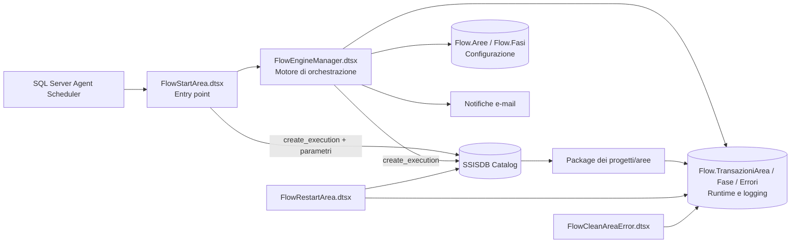
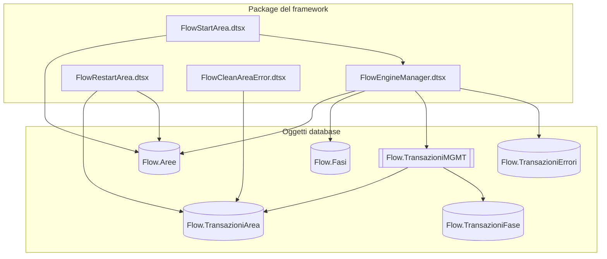
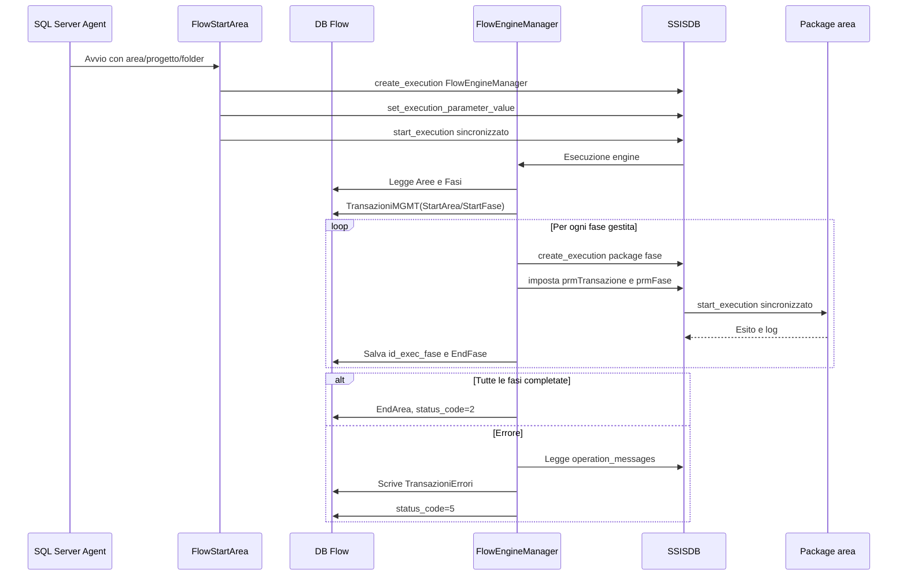
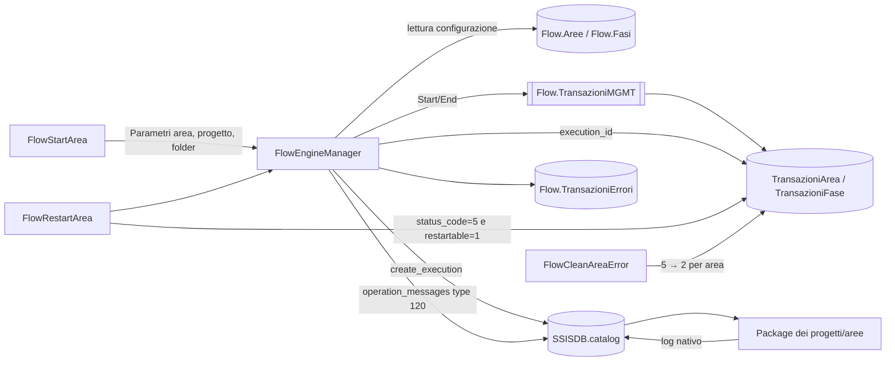
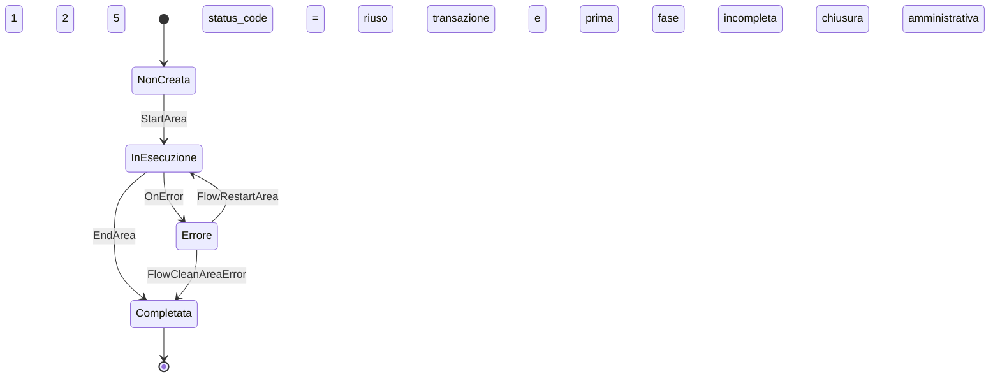
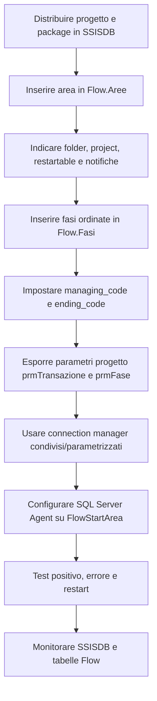

# SSIS Flow Framework

**Documentazione architetturale, funzionale e tecnica del progetto SSIS FlowManagement**

| Voce | Valore |
|---|---|
| Piattaforma | Microsoft SQL Server Integration Services (SSIS) |
| Motore di esecuzione | SSIS Catalog (`SSISDB`) |
| Database di controllo | `DataHub`, schema `Flow` |
| Entry point | `FlowStartArea.dtsx` |
| Motore di orchestrazione | `FlowEngineManager.dtsx` |
| Gestione restart | `FlowRestartArea.dtsx` |
| Chiusura amministrativa errori | `FlowCleanAreaError.dtsx` |

---

## 1. Introduzione e scopo del framework

SSIS FlowManagement è un framework di orchestrazione progettato per standardizzare l'avvio, il controllo, il monitoraggio e il riavvio delle elaborazioni SSIS organizzate per **area** e **fase**. Il framework separa la logica di governo dalla logica applicativa: i package dei singoli progetti eseguono le trasformazioni di business, mentre FlowManagement determina quali package avviare, in quale ordine, con quali parametri e con quale tracciamento.

Gli obiettivi principali sono:

- centralizzare la configurazione dei flussi;
- rendere uniforme l'esecuzione di progetti SSIS differenti;
- tracciare ogni elaborazione tramite una transazione di area e le relative transazioni di fase;
- integrare il logging applicativo con il logging nativo di SSISDB;
- interrompere il flusso in modo controllato in caso di errore;
- supportare il restart dalla prima fase non completata;
- fornire identificativi di correlazione utilizzabili dai package applicativi;
- ridurre la duplicazione di logica di orchestrazione nei singoli progetti.

Il modello logico è gerarchico:

1. **Area**: unità funzionale schedulabile, associata a un progetto SSISDB.
2. **Fase**: singolo package o passo ordinato dell'area.
3. **Transazione di area**: istanza runtime dell'intera elaborazione.
4. **Transazione di fase**: istanza runtime di una fase appartenente alla transazione.
5. **Errore**: evento tecnico correlato a transazione e fase.

---

## 2. Architettura generale



L'avvio ordinario parte da SQL Server Agent, che richiama `FlowStartArea.dtsx`. Il package di ingresso crea nel catalogo SSISDB un'esecuzione di `FlowEngineManager.dtsx`, imposta i parametri di progetto e avvia il motore in modalità sincronizzata (`SYNCHRONIZED = 1`).

`FlowEngineManager.dtsx` legge la configurazione da `Flow.Aree` e `Flow.Fasi`, inizializza o riprende la transazione, esegue in sequenza i package delle fasi tramite le stored procedure del catalogo SSISDB e aggiorna le tabelle runtime. In caso di errore, interroga `SSISDB.catalog.operation_messages`, registra i dettagli in `Flow.TransazioniErrori`, invia le notifiche previste e assegna alla transazione lo stato di errore.

I package applicativi non vengono incorporati nel framework: rimangono nei rispettivi progetti e folder SSISDB. Il collegamento avviene mediante i metadati `folder`, `project` e `job` e tramite i parametri standard `prmTransazione` e `prmFase`.

---

## 3. Componenti principali



### 3.1 Package del framework

| Package | Responsabilità |
|---|---|
| `FlowStartArea.dtsx` | Entry point dell'esecuzione ordinaria. Riceve i dati dell'area e avvia `FlowEngineManager.dtsx` in SSISDB. |
| `FlowEngineManager.dtsx` | Motore centrale. Legge la configurazione, crea la transazione, seleziona le fasi, esegue i package, registra esiti ed errori e invia notifiche. |
| `FlowRestartArea.dtsx` | Individua le transazioni con `status_code = 5` appartenenti ad aree riavviabili e rilancia il motore con la transazione esistente. |
| `FlowCleanAreaError.dtsx` | Esegue una chiusura amministrativa delle transazioni in errore di una specifica area, portando lo stato da `5` a `2`. |

### 3.2 Oggetti database

| Oggetto | Tipo | Responsabilità |
|---|---|---|
| `Flow.Aree` | Tabella di configurazione | Definisce area, progetto SSISDB, folder, impostazioni e-mail e riavviabilità. |
| `Flow.Fasi` | Tabella di configurazione | Definisce le fasi ordinate, il package da eseguire e i flag di governo. |
| `Flow.TransazioniArea` | Tabella runtime | Registra l'istanza complessiva dell'elaborazione e i riferimenti alle esecuzioni SSISDB. |
| `Flow.TransazioniFase` | Tabella runtime | Registra tempi e execution ID di ogni fase. |
| `Flow.TransazioniErrori` | Tabella di errore | Consolida i messaggi tecnici prelevati dal catalogo SSISDB. |
| `Flow.TransazioniMGMT` | Stored procedure | Gestisce apertura e chiusura delle transazioni di area e fase. |

---

## 4. Meccanismi comuni

### 4.1 Logging

Il framework usa due livelli complementari:

- **SSISDB** conserva il logging nativo dell'esecuzione, inclusi messaggi, stati, tempi e componenti;
- lo schema **Flow** conserva una vista applicativa e correlata per area, fase e transazione.

Gli execution ID sono registrati in:

- `Flow.TransazioniArea.id_exec_flow`: esecuzione del motore;
- `Flow.TransazioniArea.id_exec_area`: esecuzione associata al progetto/area;
- `Flow.TransazioniFase.id_exec_fase`: esecuzione del package di fase.

### 4.2 Gestione errori

In caso di errore il motore:

1. intercetta l'evento SSIS;
2. interroga `SSISDB.catalog.operation_messages` filtrando `message_type = 120`;
3. inserisce i dettagli in `Flow.TransazioniErrori`;
4. prepara e invia la notifica e-mail in base alla configurazione dell'area;
5. aggiorna `Flow.TransazioniArea.status_code` a `5`;
6. impedisce la normale chiusura della transazione.

### 4.3 Parametrizzazione

I parametri principali passati al motore sono:

| Parametro | Significato |
|---|---|
| `prmArea` | Codice dell'area da elaborare. |
| `prmTransazione` | Identificativo della transazione; `0` indica un nuovo avvio. |
| `prmProjectFolder` | Folder SSISDB del progetto applicativo. |
| `prmProject` | Nome del progetto SSISDB applicativo. |
| `prmExecutionIDFlow` | Execution ID dell'istanza del motore. |

I package applicativi ricevono almeno `prmTransazione` e `prmFase`, così da correlare attività e log al framework.

### 4.4 Connection manager condivisi

I package del framework usano connessioni parametrizzate al database di controllo. Nei progetti applicativi è opportuno adottare connection manager di progetto o environment reference SSISDB, evitando credenziali e nomi server codificati nei package. La configurazione ambientale deve restare separata dalla sequenza logica delle fasi.

### 4.5 Restart e checkpoint

Il checkpoint applicativo non dipende dal file checkpoint nativo di SSIS, ma dalle tabelle runtime. Una fase è completata quando `Flow.TransazioniFase.end_time` è valorizzato. Il motore determina la prima fase da riprendere cercando la fase minima ancora aperta. `FlowRestartArea.dtsx` considera soltanto transazioni con `status_code = 5` e aree con `restartable = 1`.

---

## 5. Schema ER delle tabelle

```mermaid
erDiagram
  AREE ||--o{ FASI : definisce
  AREE ||--o{ TRANSAZIONI_AREA : esegue
  TRANSAZIONI_AREA ||--o{ TRANSAZIONI_FASE : contiene
  TRANSAZIONI_AREA ||--o{ TRANSAZIONI_ERRORI : registra
  FASI ||--o{ TRANSAZIONI_FASE : istanzia
  AREE {
    nvarchar area PK
    nvarchar area_desc
    int mail_code
    varchar project
    varchar folder
    int restartable
  }
  FASI {
    varchar area PK_FK
    int fase PK
    varchar fase_desc
    varchar job
    int ending_code
    int managing_code
  }
  TRANSAZIONI_AREA {
    int transazione PK
    nvarchar area FK
    int status_code
    datetime start_time
    datetime end_time
    bigint id_exec_flow
    bigint id_exec_area
  }
  TRANSAZIONI_FASE {
    int transazione PK_FK
    int fase PK
    datetime start_time
    datetime end_time
    bigint id_exec_fase
  }
  TRANSAZIONI_ERRORI {
    int idErrore PK
    int transazione FK
    int fase
    datetime eventTime
    nvarchar packageName
    nvarchar taskName
    int errorCode
    nvarchar errorDesc
  }
```

Le relazioni logiche sono evidenziate dal modello, anche quando gli script forniti non dichiarano esplicitamente vincoli di foreign key. L'integrità applicativa è quindi affidata principalmente al motore e alla stored procedure di gestione.

---

## 6. Tabelle e stored procedure di configurazione

### 6.1 `Flow.Aree`

| Colonna | Tipo | Significato |
|---|---|---|
| `area` | `nvarchar(50)` | Chiave primaria e codice univoco dell'area. |
| `area_desc` | `nvarchar(100)` | Descrizione leggibile dell'area. |
| `mail_code` | `int` | Codice che governa il comportamento delle notifiche. |
| `to_address` | `varchar(250)` | Destinatari principali delle notifiche. |
| `cc_address` | `varchar(250)` | Destinatari in copia. |
| `subject` | `varchar(250)` | Oggetto base della notifica. |
| `message` | `varchar(250)` | Testo base della notifica. |
| `data_ins` | `datetime` | Data di inserimento, con default `GETDATE()`. |
| `project` | `varchar(20)` | Nome del progetto applicativo in SSISDB. |
| `folder` | `varchar(50)` | Folder SSISDB che contiene il progetto. |
| `restartable` | `int` | `1` se l'area può essere riavviata automaticamente, altrimenti `0`. |

### 6.2 `Flow.Fasi`

| Colonna | Tipo | Significato |
|---|---|---|
| `area` | `varchar(20)` | Area di appartenenza; parte della chiave primaria. |
| `fase` | `int` | Numero progressivo della fase; parte della chiave primaria. |
| `fase_desc` | `varchar(50)` | Descrizione funzionale della fase. |
| `job` | `varchar(50)` | Nome del package `.dtsx` da eseguire. |
| `ending_code` | `int` | Identifica il limite finale del flusso gestito. |
| `managing_code` | `int` | Indica se la fase è governata dal motore. |
| `data_ins` | `datetime` | Data di inserimento, con default `GETDATE()`. |

### 6.3 `Flow.TransazioniMGMT`

La stored procedure riceve `@P_AREA`, `@P_FASE`, `@P_STEP_FLOW` e `@P_TRANSAZIONE OUTPUT`. Supporta quattro operazioni:

| Operazione | Effetto |
|---|---|
| `StartArea` | Inserisce `Flow.TransazioniArea` con `status_code = 1`, valorizza `start_time` e restituisce la nuova transazione; apre anche la prima fase. |
| `StartFase` | Inserisce la fase se non è già presente per la transazione. |
| `EndFase` | Valorizza `end_time` della fase. |
| `EndArea` | Valorizza `end_time` dell'area e imposta `status_code = 2`. |

---

## 7. Tabelle di logging ed errori

### 7.1 `Flow.TransazioniArea`

| Colonna | Significato |
|---|---|
| `transazione` | Identificativo identity dell'esecuzione complessiva. |
| `area` | Area elaborata. |
| `status_code` | Stato runtime: `1` in esecuzione, `2` completata, `5` in errore. |
| `start_time` / `end_time` | Intervallo temporale dell'elaborazione. |
| `id_exec_flow` | Execution ID SSISDB del motore. |
| `id_exec_area` | Execution ID SSISDB associato all'area/progetto. |

### 7.2 `Flow.TransazioniFase`

| Colonna | Significato |
|---|---|
| `transazione` | Collegamento alla transazione di area. |
| `fase` | Numero della fase. |
| `start_time` / `end_time` | Intervallo temporale della fase. |
| `id_exec_fase` | Execution ID SSISDB del package di fase. |

### 7.3 `Flow.TransazioniErrori`

| Colonna | Significato |
|---|---|
| `idErrore` | Identificativo identity dell'errore. |
| `transazione` | Transazione correlata. |
| `fase` | Fase correlata; può essere `0` per errori a livello di motore/area. |
| `eventTime` | Data e ora dell'evento. |
| `packageName` | Package che ha generato o registrato l'errore. |
| `taskName` | Task o componente interessato. |
| `errorCode` | Codice tecnico dell'errore. |
| `errorDesc` | Messaggio completo. |

---

## 8. Sequenza esecutiva di una elaborazione



La selezione delle fasi tiene conto della prima fase non completata e della fase marcata come terminale. Le fasi vengono ordinate per numero e avviate una alla volta. La modalità sincronizzata garantisce che il motore conosca l'esito di ciascun package prima di procedere al successivo.

---

## 9. Interazioni principali



Il catalogo SSISDB svolge tre ruoli: deployment e risoluzione dei package, esecuzione parametrizzata e repository tecnico dei messaggi. Le tabelle Flow non sostituiscono SSISDB, ma ne organizzano i riferimenti secondo il modello applicativo area/fase/transazione.

---

## 10. Evoluzione dello stato runtime



| `status_code` | Stato | Significato operativo |
|---:|---|---|
| `1` | In esecuzione | La transazione è stata aperta e non è ancora conclusa. |
| `2` | Completata | Tutte le fasi previste sono terminate oppure la transazione è stata chiusa amministrativamente. |
| `5` | Errore | Il flusso è terminato in errore ed è candidato al restart se l'area è riavviabile. |

Il restart riutilizza la stessa transazione. In questo modo rimangono coerenti la storia delle fasi, gli errori e gli execution ID già acquisiti.

---

## 11. Componenti interni dei package DTSX

### 11.1 `FlowStartArea.dtsx`

| Componente | Tipo | Descrizione |
|---|---|---|
| `Execute Area` | Execute SQL Task | Crea e avvia in SSISDB l'esecuzione di `FlowEngineManager.dtsx`, imposta i parametri e verifica lo stato finale. |

### 11.2 `FlowEngineManager.dtsx`

| Componente | Tipo | Descrizione |
|---|---|---|
| `Setting of Flow Phases` | Execute SQL Task | Legge area, fasi e prima fase da eseguire; inizializza la transazione e gli execution ID. |
| `Loop Flow Phases` | Foreach Loop Container | Itera il result set delle fasi configurate. |
| `Start Transazione` | Execute SQL Task | Apre la transazione di area quando necessario. |
| `Start Fase` | Execute SQL Task | Registra l'avvio della fase. |
| `Execute Fase` / `Execute Package Task` | Execute SQL / Execute Package | Avvia il package applicativo tramite SSISDB. |
| `End Fase` | Execute SQL Task | Registra il completamento della fase. |
| `End Transazione` | Execute SQL Task | Chiude l'area con stato completato. |
| `Check Fase Transazione` | Script Task | Controlla condizioni e propagazione del flusso. |
| `Log TransazioniErrori` | Execute SQL Task | Estrae i messaggi SSISDB e li inserisce nella tabella errori. |
| `Update TransazioniArea status 5` | Execute SQL Task | Marca la transazione in errore. |
| `Start Notification` / `End Job Notification` / `Notifica Errore` | Send Mail Task | Invia notifiche configurate. |

### 11.3 `FlowRestartArea.dtsx`

| Componente | Tipo | Descrizione |
|---|---|---|
| `Load Transazioni in Crash` | Execute SQL Task | Seleziona transazioni con stato `5` e area `restartable = 1`. |
| `Foreach Loop Container` | Foreach Loop | Itera le transazioni da riavviare. |
| `Execute Area` | Execute SQL Task | Rilancia `FlowEngineManager.dtsx` passando la transazione esistente. |
| `Pausa 15 secondi` | Execute SQL Task | Introduce un intervallo fra i riavvii. |

### 11.4 `FlowCleanAreaError.dtsx`

| Componente | Tipo | Descrizione |
|---|---|---|
| `Clean Area` | Execute SQL Task | Imposta a `2` le transazioni con stato `5` della specifica area. |

---

## 12. Utilizzo e integrazione con SSISDB

Il framework invoca direttamente le stored procedure del catalogo:

- `SSISDB.catalog.create_execution` crea l'istanza;
- `SSISDB.catalog.set_execution_parameter_value` assegna parametri di progetto e di sistema;
- `SSISDB.catalog.start_execution` avvia l'esecuzione;
- `SSISDB.catalog.executions` fornisce lo stato e gli execution ID;
- `SSISDB.catalog.operation_messages` fornisce i messaggi tecnici.

L'esito positivo atteso è lo stato catalogo `7` (Succeeded). Un valore differente genera un errore nel task chiamante e attiva il ramo di gestione errori.

La modalità `SYNCHRONIZED = 1` è essenziale per l'orchestrazione sequenziale: la chiamata ritorna soltanto alla conclusione del package, permettendo al motore di decidere se chiudere la fase o attivare la gestione dell'errore.

---

## 13. Convenzioni per i progetti che utilizzano il framework



### 13.1 Requisiti minimi

Un nuovo progetto deve:

1. essere distribuito in SSISDB;
2. avere un record in `Flow.Aree` con folder e project corretti;
3. avere una o più righe ordinate in `Flow.Fasi`;
4. esporre i parametri di progetto `prmTransazione` e `prmFase`;
5. usare nomi package compatibili con la colonna `Flow.Fasi.job`;
6. restituire un errore SSIS reale quando la fase non è completabile;
7. non mascherare gli errori se il framework deve interrompere il flusso;
8. rendere idempotenti o controllabili le fasi candidate al restart.

### 13.2 Convenzioni raccomandate

- numerare i package coerentemente con la fase;
- mantenere un package per responsabilità elaborativa;
- usare parametri SSISDB o environment reference per connessioni e segreti;
- correlare eventuali log applicativi con `prmTransazione` e `prmFase`;
- evitare dipendenze implicite tra fasi non rappresentate nella configurazione;
- impostare `ending_code = 1` sulla fase che delimita la fine del flusso;
- impostare `managing_code = 1` sulle fasi governate dal motore;
- validare esplicitamente il comportamento di restart prima del rilascio;
- verificare che account SQL Agent e SSISDB dispongano dei permessi necessari.

### 13.3 Checklist di onboarding

| Controllo | Esito atteso |
|---|---|
| Deployment SSISDB | Folder, progetto e package visibili. |
| Configurazione area | Record univoco e coerente in `Flow.Aree`. |
| Configurazione fasi | Sequenza completa e ordinata in `Flow.Fasi`. |
| Parametri | `prmTransazione` e `prmFase` valorizzabili. |
| Test ordinario | Stato finale `2`, tempi e execution ID registrati. |
| Test errore | Stato `5` e dettaglio in `Flow.TransazioniErrori`. |
| Test restart | Ripartenza dalla prima fase non completata. |
| Monitoraggio | Tracciabilità completa tra Flow e SSISDB. |

---

## Appendice A — Mappa dei diagrammi PNG

| Diagramma | File |
|---|---|
| Architettura generale | `01_architettura_generale.png` |
| Componenti principali | `02_componenti_principali.png` |
| Schema ER | `03_schema_er.png` |
| Sequenza esecutiva | `04_sequenza_esecutiva.png` |
| Interazioni principali | `05_interazioni.png` |
| Stati runtime | `06_stati_runtime.png` |
| Aggancio nuovo progetto | `07_aggancio_nuovo_progetto.png` |
